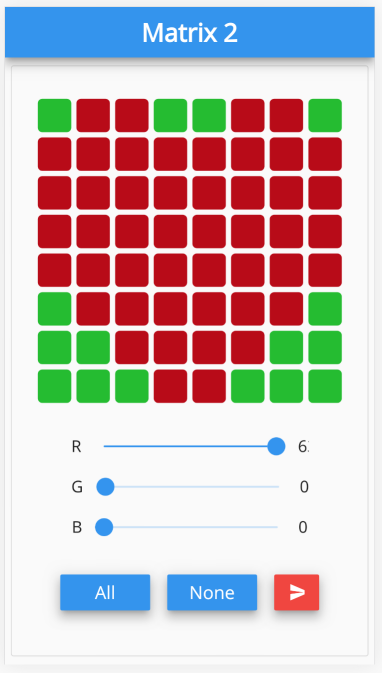

# matrix2 

<a href="https://stackoverflow.com/questions/tagged/flutter?sort=votes">  </a>


A toy project to drive Sense Hat's LED matrix by using Go and Flutter 

<br/> <br/>

## 1. Description

This project consists of 2 parts:
- A simple mobile front-end based on Flutter/Web that can modify the matrix data for 64 LEDs on Sense Hat.
- A Golang based web server with WebSocket that accepts the configuration from the front-end and controls the LEDs via I2C.

## 2. Prerequisites

First of all, the user should be familiar with Raspberry Pi and its terminal interface.
Unfortunately, **RPI 3B+** should be used for this project because of the memory size.

### 2.1. I2C interface activation

Enable i2c communication by using raspi-config.

```
sudo raspi-config
```

### 2.2. Docker installation

Get Docker's prerequisites as follow.

```
sudo apt-get install \
     apt-transport-https \
     ca-certificates \
     curl \
     gnupg2 \
     software-properties-common \
     git
```

Docker itself can be installed and activated by these commands.

```
curl -sSL https://get.docker.com | sh

sudo systemctl enable docker
sudo systemctl start docker
```

### 2.3. User permission for Docker

To give the permission to user docker command, the current username should be added to the docker group in the file.

```
sudo vi /etc/group
```

Don't forget rebooting to apply the change.

```
sudo reboot
```

## 3. How to run

Now, everything is ready to run.
Please follow the below commands and access to **localhost:3000** from a web browser.

```
git clone https://github.com/bus710/matrix2

cd matrix2/src/docker # or docker_for_arm64v8 for Ubuntu ARM64 on RPI

docker build -t matrix2 .

docker run -p 3000:3000 --device /dev/i2c-1 -it --rm --name matrix2i matrix2
```

From the browser, the frontend can be shown on the screen like this.  



The components have features like this:
- Each box represents each LED on Sense Hat (each box can be pressed to be chosen).
- The sliders can change the color of boxes selected.
- All and None buttons can be used to pick all or none of the boxes.
- The red button can be used to send the configuration to the backend. 

## 4. Clean up

Things should work properly but before closing, the images and containers should be cleaned up with these commands:
```
docker rm -f $(docker ps -qa)
docker rmi $(docker images -q)
```

## 5. Conclusion

With this simple project, the LEDs on Sense Hat can be easily controlled by the front-end and there is no such procedure to install any comlex development tools. However, anyone interests to use Flutter, Golang, or the I2C of RPI may check the source code in the repository to add more feature. 

## Writer

- SJ Kim - <bus710@gmail.com>


----
**Disclaimer**  
  
```
This is just a toy project that cannot be used for safety/commercial products.   
The developer doesn't take any kind of (phsical, mental, and financial) responsibility. 
```
